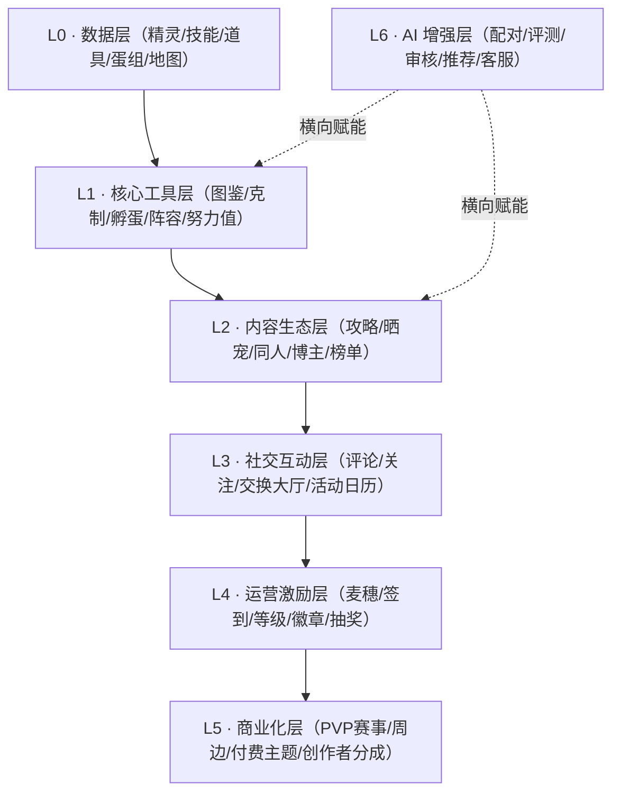
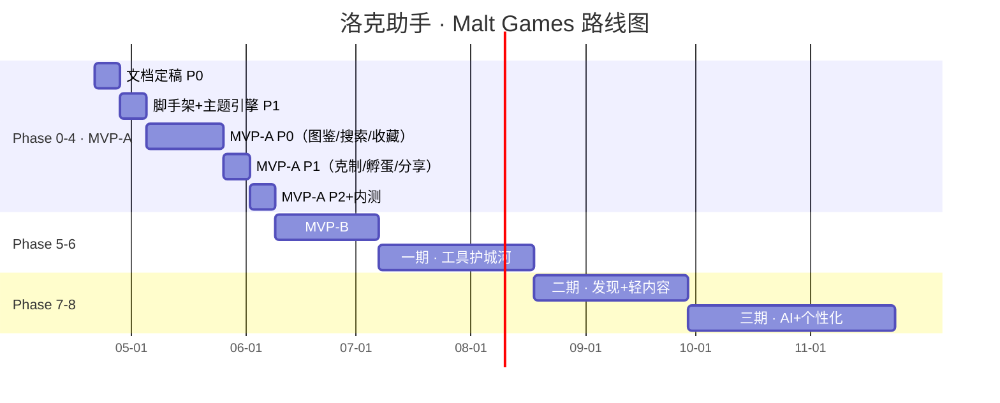

# 00 · 产品宪章与全阶段路线图

> 本文件是所有后续决策的"最高法"。任何功能提议、任何排期调整，必须先通过本文件的铁律与分层检验。

---

## 一、产品宪章

### 1.1 一句话定位

**洛克助手 · Malt Games**：以精灵资料、克制计算、养成辅助为核心的《洛克王国：世界》玩家助手。

### 1.2 三阶段定位

| 阶段 | 定位 | 时间窗口 |
|---|---|---|
| 阶段 1（工具期） | 最好用的工具助手 | Phase 0 ~ Phase 6 |
| 阶段 2（内容期） | 最好看的资料与内容发现站 | Phase 7 |
| 阶段 3（生态期） | 最有活力的玩家内容与创作者平台 | Phase 8+ |

**此顺序不可逆。** 没有阶段 1 的工具用户基础，阶段 2/3 都是空中楼阁。

### 1.3 北极星指标（North Star Metric）

- **每周活跃工具查询次数**（Weekly Active Tool Queries, WATQ）
  - 定义：一次"有效查询"= 用户在图鉴/搜索/克制/孵蛋任一入口产生一次成功返回结果的交互
  - 为什么不是 DAU：DAU 无法区分"打开看一眼就走"和"真正把我们当工具用"，WATQ 更贴近"工具心智建立"
  - 阶段 1 目标：WATQ / WAU ≥ 5（用户平均每周用我们 5 次以上工具）

### 1.4 面向的四类核心用户

| 画像 | 占比估计 | 核心诉求 | MVP-A 必须满足 |
|---|---|---|---|
| 工具党（查数据） | 60% | 快、准、能离线 | 图鉴 / 克制 / 孵蛋 / 搜索 |
| 成长党（养精灵） | 20% | 配队、推荐、训练 | 一期上线（阵容/努力值） |
| 社交党（晒/换/聊） | 10% | 交换、晒宠、互动 | 二期上线 |
| 内容党（写/看攻略） | 10% | 攻略、博主、打赏 | 二期上线 |

**MVP-A 只服务工具党。** 不要为 40% 的其他人群做妥协。

---

## 二、六条铁律

### 铁律 1 · 工具优先，平台后置

> 我们不是社区平台，不是创作者平台，是"工具"。

- 任何非工具功能在 Phase 6 之前都要通过"是否直接支撑工具体验"的检验。
- 举例：签到系统不过线（留存手段，不是工具）；分享卡过线（直接放大工具价值）。

### 铁律 2 · 搜索是一号入口

> 搜索不是一个功能，是整个产品的门。

- 首页、图鉴页、详情页、工具页都要为搜索服务。
- 搜索六件套（MVP-A P0/P1 分批交付）：名称、编号、模糊、历史、热门、AI 兜底。
- 搜索失败的体验和搜索成功的体验同样重要。

### 铁律 3 · 收藏是第一留存，分享是第一增长

> 前期不靠活动、不靠邀请，靠用户自然产生的"资产"和"传播"。

- **收藏**：前期最重要的用户资产，比等级、麦穗都早。体验必须有记忆点（收藏动画、收藏夹分组预留）。
- **分享**：前期最强裂变，依赖"有价值内容的一键分享"——精灵详情卡、克制结果卡、孵蛋结果卡、阵容卡。
- 分享卡要满足一条最高原则：**脱离产品本体也有内容价值，进入产品后又有进一步价值。**

### 铁律 4 · 主题是品牌力，不是装饰

> 首发两套主题，不是为了好看，是为了让用户第一眼相信"这个产品不是一次性项目"。

- MVP-A/B 首发两套：洛克日（默认暖色）/ 深海光年（暗色酷炫）。
- 主题引擎必须在 P0 就架构好（CSS 变量 + 运行时切换），但资产可以 P1 再上第二套。
- 节气/赛季/精灵主题池延迟到二期以后，前期不做主题商城。

### 铁律 5 · 复杂系统一律延后

> 每晚做一个复杂系统一周，产品成功率就多 5 个百分点。

以下系统**在 Phase 6 之前禁止开发**：

- 麦穗经济完整体系（签到除外，签到后置到二期）
- 等级 / 徽章完整体系（基础等级后置到二期）
- 博主入驻 / 博主榜 / 创作者分成
- 私信 / 关注 / 粉丝
- 晒宠广场完整社区
- 同人二创专区
- 交换大厅完整功能
- PVP 赛事报名
- 周边商城
- AI 攻略生成 / AI 相似推荐 / AI 客服

### 铁律 6 · 数据与合规从 D1 设计

> 数据是这个产品的真正资产，合规是这个产品的真正红线。

- 所有资料必须带：版本号、来源、更新时间、可信标签。
- 所有 UGC 入口（哪怕现在没有）在 API 设计时就要预留审核字段。
- 视觉资产（立绘、图标、地图）授权问题要在 Phase 0 文档里写死。
- 小程序审核合规项（订阅消息、抽奖概率公示、虚拟币不提现）提前对齐。

---

## 三、分层定位（Lxx）

**分层映射到阶段：**

| 阶段 | 主攻分层 | 辅助分层 |
|---|---|---|
| MVP-A / MVP-B / 一期 | L0 + L1 | - |
| 二期 | L2 轻量 + L3 轻量 | L4 轻量（仅签到） |
| 三期 | L2 完整 + L6（仅配队/评测） | L4 完整 |
| 四期以后 | L3 完整 + L5 | L6 扩展 |

---

## 四、全阶段路线图

### 4.1 阶段一览

| Phase | 名称 | 工期 | 关键交付 | 关卡 |
|---|---|---|---|---|
| P0 | 文档定稿 | 1 周 | 7 份 Markdown 文档 | 前后端评审通过 |
| P1 | 脚手架+主题引擎 | 1 周 | 新仓库、路由、TabBar、主题引擎、API Client 骨架 | 能跑通 H5+微信小程序 Hello World |
| P2 | MVP-A P0 | 3 周 | 图鉴列表、详情、搜索、收藏、静默登录、主题 A、缓存、埋点 | 小范围内测可用 |
| P3 | MVP-A P1 | 1 周 | 克制 V1、孵蛋 V1、分享卡 V1、主题 B | 内测扩群 |
| P4 | MVP-A P2 + 内测 | 1 周 | 动效、引导、可信标签完整、分享卡第二模板 | **验证门槛检查** |
| P5 | MVP-B | 4 周 | 技能/道具图鉴、孵蛋完整、克制热力图、第二套主题完整资产 | - |
| P6 | 一期 | 6 周 | 蛋组/努力值/性格/阵容/隐藏精灵/活动日历/云同步 | 工具层定型 |
| P7 | 二期 | 6 周 | 发现页/攻略投稿/点赞评论/敏感词/麦穗 V1/等级 V1 | 社区冷启动 |
| P8 | 三期 | 8 周 | AI 配队/AI 评测/搜索兜底/晒宠广场/博主主页/赛季专题 | 差异化护城河 |
| P9+ | 更远期 | 待定 | 交换大厅/同人/赛事/商城/创作者结算 | - |

### 4.2 不可回退原则

- **P4 验证门槛不达标 → 收敛问题定义而不是继续加功能。** 详见 `01-mvp-a-p0p1p2.md` 第 4 章。
- **P7 开始 UGC → 审核能力必须先上。** 审核不过关不允许开投稿入口。
- **P8 AI 落地 → 只做配队+评测两个拳头，不扩散。**

---

## 五、团队与节奏

### 5.1 团队组成（当前）

- 前端：2-3 人（uni-app + Vue 3 + TS 为主）
- 后端：1-2 人（Go 为主）
- 设计 / 数据整理：兼职或外部协作

### 5.2 工作节奏

- **每周一 15 分钟同步会**：上周进度 + 本周目标 + 阻塞问题
- **每 Phase 末 30 分钟回顾会**：指标快照 + 决定是否进入下一 Phase + 路线图微调
- **每双周一次 30 分钟用户访谈**：从 P2 起开始，每次找 2-3 个真实洛克王国玩家

### 5.3 文档维护

- 所有 Phase 0 文档定稿后迁入新仓库 `loka-spirit-helper/docs/`
- 重大变更通过 PR 走评审，`CHANGELOG.md` 记录
- 每个 Phase 末追加一次"决策复盘"到对应文档末尾

---

## 六、战略上不做的事（Say No List）

这份清单比"要做什么"更重要，每季度 review 一次。

- **不做游戏模拟器 / 自动打图工具** —— 游戏方红线
- **不做账号代练 / 代打服务** —— 红线
- **不做精灵交易货币化**（用户间卖精灵） —— 红线
- **不做可提现的虚拟币** —— 合规
- **不做强制分享或强制邀请** —— 微信生态红线
- **不做涉黄涉政涉暴内容** —— 永远
- **不追求"功能数量"胜过竞品** —— 追求"核心工具体验"领先
- **不盲目做 App** —— 小程序/H5 优先，App 等用户明确需要再做

---

## 七、评审 checklist（本文件）

- [ ] 产品定位是否清晰、可被团队成员复述
- [ ] 六条铁律是否所有成员都认可并能当场举例
- [ ] 北极星指标（WATQ / WAU）是否被后端的埋点设计覆盖
- [ ] 分阶段路线图是否和团队现有精力匹配
- [ ] Say No List 是否有遗漏

---

## 附：本文件版本

- v1.0 · 2026-04-21 · Phase 0 初稿
