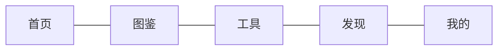
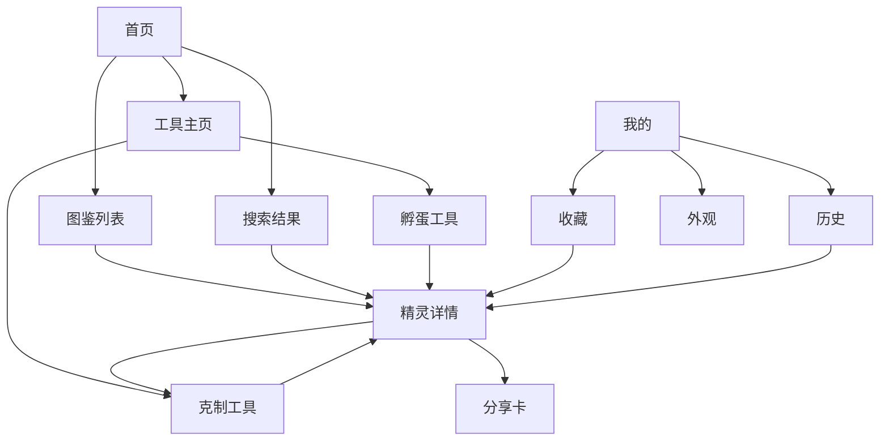
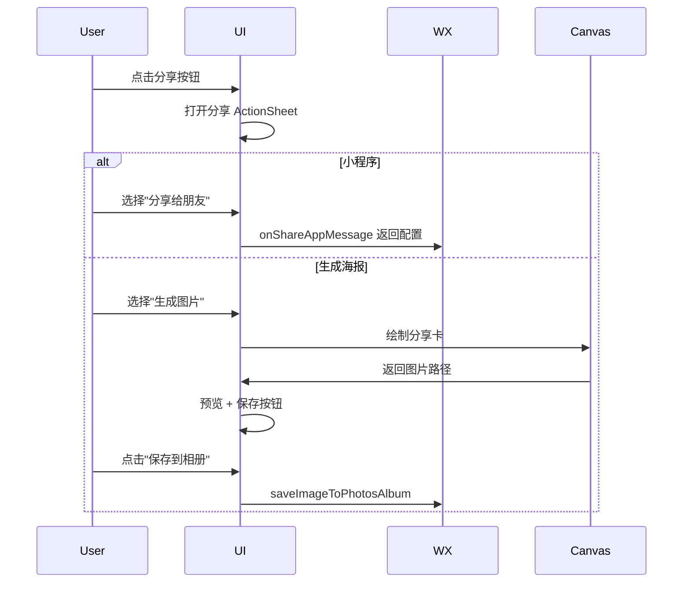
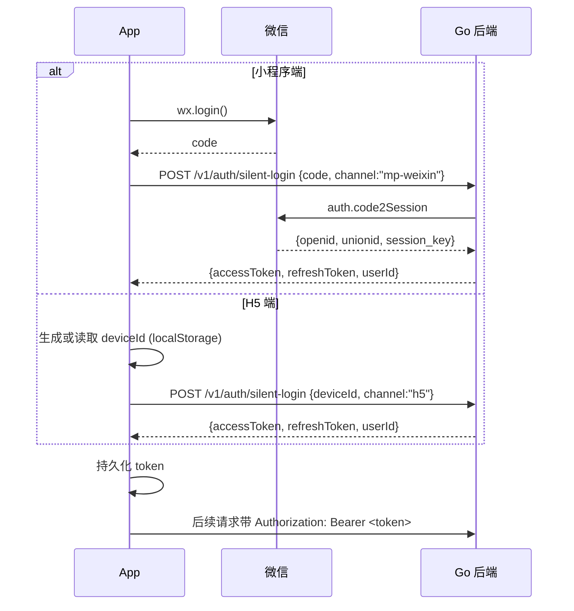

# 03 · 核心页 PRD · MVP-A

> 本文件是 MVP-A 八个核心功能的页面级规范。每个功能包含：目标 / 入口 / 信息架构 / 关键交互 / 边界情况 / 状态设计 / 埋点 / 评审 checklist。

---

## 目录

- [一、信息架构总览](#一信息架构总览)
- [二、首页 Home](#二首页-home)
- [三、精灵图鉴列表 SpiritList](#三精灵图鉴列表-spiritlist)
- [四、精灵详情 SpiritDetail](#四精灵详情-spiritdetail)
- [五、孵蛋推测 V1 HatchPredict](#五孵蛋推测-v1-hatchpredict)
- [六、属性克制 V1 TypeMatchup](#六属性克制-v1-typematchup)
- [七、分享卡 V1 ShareCard](#七分享卡-v1-sharecard)
- [八、主题引擎 ThemeEngine](#八主题引擎-themeengine)
- [九、静默登录 SilentLogin](#九静默登录-silentlogin)
- [十、"我的"页面 Me](#十我的页面-me)
- [十一、全局交互规范](#十一全局交互规范)

---

## 一、信息架构总览

### 1.1 一级导航（TabBar · 5 项）



- **首页**：搜索 + 推荐入口 + 快速工具 + 版本/活动卡片
- **图鉴**：结构化精灵资料库（MVP-A 仅精灵；MVP-B 起加技能/道具）
- **工具**：高价值计算工具（克制 + 孵蛋，MVP-A 上线）
- **发现**：内容消费入口（MVP-A 仅放"资讯聚合"占位卡；二期做内容）
- **我的**：收藏 / 历史 / 外观 / 关于

### 1.2 页面路由清单（MVP-A）

```
/pages/home/index               首页
/pages/discover/index           发现（MVP-A 仅占位）
/pages/me/index                 我的

/pages-spirit/list/index        图鉴列表
/pages-spirit/detail/index      精灵详情

/pages-tools/index              工具主页
/pages-tools/type-matchup       克制工具
/pages-tools/hatch-predict      孵蛋工具

/pages-me/favorites             我的收藏
/pages-me/history               浏览历史
/pages-me/appearance            外观/主题
/pages-me/about                 关于 + 数据版本 + 更新日志
/pages-me/feedback              反馈入口
```

### 1.3 页面层级示意



---

## 二、首页 Home

### 2.1 目标

- 3 秒内让用户明白"这个产品能帮我做什么"
- 把搜索、收藏、工具这三件事的入口放在最高优先级

### 2.2 入口

- TabBar "首页"
- 小程序首次进入默认落地
- H5 从外部链接进入的默认落地（除非带指定路径参数）

### 2.3 信息架构

```
┌──────────────────────────────────┐
│ [自定义 NavBar: Logo + 主题切换]    │  高 44px（+状态栏）
├──────────────────────────────────┤
│ [搜索框: 请输入精灵名或编号]        │  高 52px
├──────────────────────────────────┤
│ [Banner 卡片 · 1 张 · 可点击]       │  高 160px
│  当前数据版本 v2026.04.3            │
│  更新了 12 只精灵 · 点击查看        │
├──────────────────────────────────┤
│ [快速工具 · 4 宫格]                 │  高 120px
│  图鉴 · 克制 · 孵蛋 · 我的收藏      │
├──────────────────────────────────┤
│ [热门精灵 · 横滑 · 最多 8 张]       │  高 180px
│ (数据来自后端"最近 7 日详情浏览 TOP")│
├──────────────────────────────────┤
│ [最近查看 · 横滑 · 最多 6 张]       │  高 160px
│ (数据来自本地 history)              │
├──────────────────────────────────┤
│ [提示卡: 反馈 / 数据纠错入口]        │
└──────────────────────────────────┘
```

### 2.4 关键交互

| 元素 | 交互 | 说明 |
|---|---|---|
| 搜索框 | 点击 | 跳到搜索页（图鉴列表页的搜索模式） |
| 搜索框 | 语音图标 | 可见但灰置（P2 再上） |
| 主题切换 | 点击 | 弹出主题切换抽屉 |
| Banner | 点击 | 跳到"关于 → 数据更新日志" |
| 4 宫格 · 图鉴 | 点击 | 跳 `pages-spirit/list` |
| 4 宫格 · 克制 | 点击 | 跳 `pages-tools/type-matchup` |
| 4 宫格 · 孵蛋 | 点击 | 跳 `pages-tools/hatch-predict` |
| 4 宫格 · 收藏 | 点击 | 跳 `pages-me/favorites` |
| 热门精灵卡 | 点击 | 跳精灵详情 |
| 热门精灵卡 | 长按 | 显示快速菜单（收藏 / 查克制 / 分享） |

### 2.5 状态设计

| 状态 | 表现 |
|---|---|
| 首次进入 | 显示骨架屏 · 500ms 内完成数据本地化 |
| 弱网 | Banner 与"热门"模块用本地缓存；缓存为空则隐藏该模块（不显示空块） |
| 无历史 | 隐藏"最近查看"模块 |
| 数据加载失败 | 提示 "数据加载中，请稍后" + 重试按钮 |

### 2.6 边界情况

- 精灵数据为空（极端）：显示"数据正在更新，请稍后再来"，整页居中展示
- 版本号 Banner 仅当有新版本时显示；无新版本显示通用欢迎卡

### 2.7 埋点

- `page_view` · property: `page=home`
- `home_banner_click`
- `home_quick_tool_click` · property: `tool=pokedex|matchup|hatch|fav`
- `home_hot_spirit_click` · property: `spirit_id`
- `home_recent_spirit_click` · property: `spirit_id`

### 2.8 评审 checklist

- [ ] 搜索框位置是否在黄金三角区（上方居中）
- [ ] 4 宫格是否覆盖 MVP-A 的核心工具
- [ ] 热门精灵数据来源与刷新频率
- [ ] 最近查看本地存储上限（建议 20 条）

---

## 三、精灵图鉴列表 SpiritList

### 3.1 目标

- 让用户快速找到想看的精灵
- 多维度筛选 + 排序 + 搜索一体化
- 单屏内传达"我们收录得全"的印象（即使首批仅 150-200 只）

### 3.2 入口

- TabBar "图鉴"
- 首页 4 宫格 · 图鉴
- 首页搜索框点击

### 3.3 信息架构

```
┌──────────────────────────────────┐
│ [顶部导航: ← 精灵图鉴 · 共 187 只]   │
├──────────────────────────────────┤
│ [搜索框: 请输入精灵名或编号进行搜索] │
├──────────────────────────────────┤
│ [属性快捷栏 · 圆形图标 · 6 项]       │
│  全部 · 普通 · 草 · 火 · 水 · 光 · 更多 │
├──────────────────────────────────┤
│ [筛选下拉 · 4 项]                    │
│  形态 · 蛋组 · 数值排序 · 赛季       │
├──────────────────────────────────┤
│ [当前筛选标签（如有） · 可单个清除] │
├──────────────────────────────────┤
│ [三列网格 · 精灵卡片 · 吸顶字母]    │
│                                    │
│   (001)  (001)  (002)              │
│   迪莫   圣光迪莫 喵喵               │
│                                    │
│   (003)  (004)  (004)              │
│   喵呜   魔力猫 叶冕魔力猫            │
│                                    │
│   ...                              │
├──────────────────────────────────┤
│ [滚动到底提示: 已显示全部 187 只]    │
├──────────────────────────────────┤
│ [浮动反馈按钮 · 右下角]              │
└──────────────────────────────────┘
```

### 3.4 精灵卡片

```
┌───────────────┐
│ ┌───────────┐ │
│ │   立绘    │ │   1:1
│ │           │ │
│ ├───────────┤ │
│ │ 001  [属] │ │   编号左下黄徽章，属性右下圆形图标
│ └───────────┘ │
│   迪莫         │   深色背景横条
└───────────────┘
```

### 3.5 关键交互

| 元素 | 交互 | 说明 |
|---|---|---|
| 搜索框 | 输入 | 300ms 节流 · 本地搜索 · 实时更新列表 |
| 搜索框 | 聚焦 | 显示"搜索历史 + 热门搜索"浮层 |
| 属性快捷 · 全部 | 点击 | 清除属性筛选 |
| 属性快捷 · 具体属性 | 点击 | 单选切换（再点取消） |
| 属性快捷 · 更多 | 点击 | 弹出"属性选择"弹窗，18 属性多选 + 确认 |
| 筛选下拉 · 形态 | 点击 | 弹出选项（常规/异色/炫彩/光辉） |
| 筛选下拉 · 蛋组 | 点击 | 弹出选项（15 个蛋组） |
| 筛选下拉 · 数值排序 | 点击 | 弹出选项（编号↑/编号↓/种族总和↑/↓/速度等6维） |
| 筛选下拉 · 赛季 | 点击 | 弹出选项（S1/S2/全部） |
| 筛选标签 | 点击 × | 移除该筛选项 |
| 精灵卡 | 点击 | 跳详情 |
| 精灵卡 | 长按 | 弹出快速菜单（收藏/查克制/分享） |
| 反馈按钮 | 点击 | 跳反馈页 |

### 3.6 搜索交互细节

```
用户输入 "迪"
→ 200ms 节流
→ 本地搜索：
   - 名称精确匹配
   - 名称前缀匹配
   - 拼音首字母匹配（"dm" → "迪莫"）
   - 拼音全拼匹配（"dimo" → "迪莫"）
   - 异名/俗称匹配
→ 按匹配度排序返回
→ 顶部显示"搜索结果 · X 只"
```

### 3.7 状态设计

| 状态 | 表现 |
|---|---|
| 加载中 | 9 张卡片骨架屏 |
| 筛选后无结果 | "没有找到符合条件的精灵" + "清除筛选" 按钮 |
| 搜索无结果 | "找不到 'xxx'，试试别的关键词？" + 最近搜索 |
| 网络错误 | 上次本地数据 + "刷新" 按钮 |

### 3.8 埋点

- `page_view` · property: `page=spirit_list`
- `spirit_list_search` · property: `query, result_count`
- `spirit_list_filter_type_select` · property: `types=[]`
- `spirit_list_filter_form_select` · property: `form`
- `spirit_list_filter_egg_select` · property: `egg_group`
- `spirit_list_sort_change` · property: `sort_by, order`
- `spirit_list_filter_season` · property: `season`
- `spirit_card_click` · property: `spirit_id, source=list`
- `spirit_card_long_press` · property: `spirit_id, action`

### 3.9 评审 checklist

- [ ] 属性快捷栏保留 5+更多 是否够用（建议 5）
- [ ] 种族值排序是否需要在 MVP-A 做（建议做，因为是工具党强需求）
- [ ] 搜索历史是否本地存储（是，上限 20 条）
- [ ] 长按快捷菜单的交互手势是否会与系统手势冲突

---

## 四、精灵详情 SpiritDetail

### 4.1 目标

- 3 秒内传达精灵关键信息（属性、种族值）
- 在一个页面内完成"查资料 → 收藏 → 分享 → 用工具"的闭环

### 4.2 入口

- 图鉴列表点击
- 搜索结果点击
- 首页热门/最近点击
- 收藏列表点击
- 孵蛋/克制工具结果点击
- 外部分享链接

### 4.3 信息架构

```
┌──────────────────────────────────┐
│ [NavBar: ← 精灵名 · [分享][...]]    │
├──────────────────────────────────┤
│ [主视觉区 · 高 320px]               │
│  - 主题色渐变背景（属性主色）        │
│  - 居中立绘                          │
│  - 右上角收藏按钮（动画）           │
│  - 左下编号徽章                     │
├──────────────────────────────────┤
│ [名称 + 属性标签 + 可信徽章]         │
│  迪莫 · [水] [光]  · ⓘ已核验         │
├──────────────────────────────────┤
│ [快捷操作栏 · 横向 3 个]             │
│  查克制 · 加入阵容(灰置) · 相似精灵(灰置) │
├──────────────────────────────────┤
│ [Tab 切换: 资料 | 技能 | 图鉴]       │
├──────────────────────────────────┤
│ Tab "资料"                          │
│ ┌────────────────────────────┐   │
│ │ 种族值雷达图 (Canvas)        │   │
│ │ + 数值列表                   │   │
│ └────────────────────────────┘   │
│ ┌────────────────────────────┐   │
│ │ 基础信息                     │   │
│ │ 身高 0.6m / 体重 12kg        │   │
│ │ 蛋组 动物组                  │   │
│ │ 数据来源 [查看]              │   │
│ └────────────────────────────┘   │
│ ┌────────────────────────────┐   │
│ │ 简介：这是一只水光双属性...  │   │
│ └────────────────────────────┘   │
│ ┌────────────────────────────┐   │
│ │ 进化链（如有）               │   │
│ └────────────────────────────┘   │
│ ┌────────────────────────────┐   │
│ │ 克制简览                     │   │
│ │ 克制他 · 被克制              │   │
│ └────────────────────────────┘   │
├──────────────────────────────────┤
│ [底部吸底操作栏]                    │
│  [分享]   [+ 收藏 / 已收藏]          │
└──────────────────────────────────┘
```

### 4.4 关键交互

| 元素 | 交互 | 说明 |
|---|---|---|
| 收藏按钮 | 点击 | 切换收藏态 · 心形动画 + 震动反馈 |
| 分享按钮（右上/底部） | 点击 | 触发分享 ActionSheet（小程序原生 / H5 生成海报） |
| 立绘 | 双击 | 全屏查看（可缩放） |
| 属性标签 | 点击 | 跳到克制工具，攻击属性预填 |
| 查克制 | 点击 | 跳到克制工具，防御属性预填 |
| 种族值雷达图 | 滑入 | 进入动画（300ms 从中心展开） |
| 数据来源 [查看] | 点击 | 弹出溯源弹窗（仅 P2 上） |
| 进化链节点 | 点击 | 跳对应精灵详情 |
| 克制简览项 | 点击 | 跳克制工具并预填 |

### 4.5 Tab 说明（MVP-A）

- **资料**：默认 Tab，MVP-A 完整展示
- **技能**：灰态显示 "技能图鉴上线中..."，MVP-B 实现
- **图鉴**：灰态显示 "图鉴合集筹备中..."（展示相似精灵推荐），MVP-B 实现

### 4.6 状态设计

| 状态 | 表现 |
|---|---|
| 加载中 | 主视觉区骨架 + 内容区骨架 |
| 数据不完整 | 缺失模块隐藏而不是展示空块 |
| 网络错误 | 上次缓存 + 顶部提示条 "使用缓存数据" |
| 外部链接进入但该精灵不存在 | 返回图鉴列表 + Toast 提示 |

### 4.7 埋点

- `page_view` · property: `page=spirit_detail, spirit_id, source`
- `spirit_detail_view` · property: `spirit_id, view_duration_sec（离开时计算）`
- `spirit_favorite_toggle` · property: `spirit_id, to=on|off`
- `spirit_share_trigger` · property: `spirit_id, channel=wx_friend|wx_timeline|h5_poster`
- `spirit_portrait_zoom`
- `spirit_tab_switch` · property: `tab=info|skill|dex`
- `spirit_matchup_entry` · property: `spirit_id, from=type_tag|cta`
- `spirit_evolution_click` · property: `from_id, to_id`

### 4.8 评审 checklist

- [ ] 主视觉区是否用属性主色做动态背景
- [ ] 雷达图是否用 Canvas（不用 echarts）
- [ ] Tab 切换是否在 MVP-A 就展示"即将上线"而不是隐藏
- [ ] 分享按钮在小程序端用原生还是自定义
- [ ] 数据不完整时的降级表现是否一致

---

## 五、孵蛋推测 V1 HatchPredict

### 5.1 目标

- 输入蛋尺寸 + 重量 → 给出候选精灵
- 结果可跳精灵详情
- 明确告知用户当前支持范围（避免预期错位）

### 5.2 入口

- TabBar "工具" → "孵蛋推测"
- 首页 4 宫格 · 孵蛋
- 精灵详情"相似精灵"（未来）

### 5.3 信息架构

```
┌──────────────────────────────────┐
│ [NavBar: ← 孵蛋推测]               │
├──────────────────────────────────┤
│ [顶部说明卡]                        │
│  你的精灵蛋信息                     │
│  ┌────────┐ ┌────────┐            │
│  │ 尺寸 m │ │ 重量 kg│            │
│  │ 0.6    │ │  12.5  │            │
│  └────────┘ └────────┘            │
│  [主按钮：反查精灵]                 │
│  ⓘ 当前支持首批精灵（v2026.04.3）   │
├──────────────────────────────────┤
│ [查询结果 · 网格]                   │
│  按相似度倒序，最多 6 张卡片         │
│  每张：立绘 + 名称 + 相似度%         │
├──────────────────────────────────┤
│ [空态 / 无匹配]                     │
│  请尝试其他尺寸 · 建议范围 0.1~30m   │
├──────────────────────────────────┤
│ [反馈按钮 · 右下角]                 │
└──────────────────────────────────┘
```

### 5.4 输入规则

| 字段 | 类型 | 范围 | 校验 |
|---|---|---|---|
| 尺寸 | number | 0.1 ~ 30 | 小数 ≤ 2 位，数字键盘 |
| 重量 | number | 0.1 ~ 500 | 小数 ≤ 1 位，数字键盘 |

- 任意字段为空时"反查精灵"按钮灰置
- 超出范围时输入框红色边框 + 错误文案
- 输入框下方有当前输入范围的淡色提示

### 5.5 算法（V1）

```typescript
// 只在"首批精灵集合"里找
function predict(input: { size: number; weight: number }) {
  const weighted = spirits.map(s => {
    const sizeDiff = Math.abs(s.size - input.size) / Math.max(s.size, input.size);
    const weightDiff = Math.abs(s.weight - input.weight) / Math.max(s.weight, input.weight);
    // 归一化后的综合距离，尺寸和重量各占 50%
    const distance = (sizeDiff + weightDiff) / 2;
    const confidence = Math.max(0, 1 - distance);
    return { spirit: s, distance, confidence };
  });

  // 只保留 confidence >= 0.6 的，最多 6 条
  return weighted
    .filter(w => w.confidence >= 0.6)
    .sort((a, b) => b.confidence - a.confidence)
    .slice(0, 6);
}
```

### 5.6 关键交互

| 元素 | 交互 | 说明 |
|---|---|---|
| 输入框 | 输入 | 实时校验 |
| 反查按钮 | 点击 | 本地计算 + 展示结果 |
| 结果卡 | 点击 | 跳精灵详情，来源参数 `?from=hatch` |
| 结果卡 | 长按 | 快捷菜单（收藏/分享） |
| 反馈按钮 | 点击 | 反馈页，预填 "孵蛋结果不准" |

### 5.7 状态设计

| 状态 | 表现 |
|---|---|
| 初始 | 显示输入区 + 底部引导文案 "输入蛋的尺寸和重量，查看可能的精灵" |
| 计算中 | 按钮转 Loading 态（实际本地计算 < 50ms 基本不可见） |
| 有结果 | 结果区淡入 + 顶部"找到 X 只可能的精灵" |
| 无结果 | 替换为空态卡 |
| 输入非法 | 按钮灰置 + 输入框红色 |

### 5.8 埋点

- `page_view` · property: `page=hatch_predict`
- `hatch_predict_submit` · property: `size, weight, result_count`
- `hatch_result_card_click` · property: `spirit_id, rank, confidence`
- `hatch_predict_no_result` · property: `size, weight`

### 5.9 评审 checklist

- [ ] 算法阈值 0.6 是否合理（等首批数据跑一批测试再调）
- [ ] 输入单位是否需要支持"克 g"切换（建议 MVP-A 只支持 kg）
- [ ] 页面是否显性告知"当前只支持首批精灵"
- [ ] 结果为空时是否引导用户反馈"我实际孵出了 X"

---

## 六、属性克制 V1 TypeMatchup

### 6.1 目标

- 用户输入攻防两方属性，即时得到倍率与建议
- 图标化、秒懂、可分享

### 6.2 入口

- TabBar "工具" → "属性克制"
- 首页 4 宫格 · 克制
- 精灵详情 · 属性标签点击 → 攻击属性预填
- 精灵详情 · 查克制按钮 → 防御属性预填

### 6.3 信息架构

```
┌──────────────────────────────────┐
│ [NavBar: ← 属性克制]               │
├──────────────────────────────────┤
│ [计算器卡]                          │
│  使用技能精灵属性 ▼ 水(点击选)      │
│  遭受攻击精灵属性 ▼ 火(点击选)      │
│  ┌──────────────────────┐         │
│  │ 伤害结果：超级克制       │         │
│  │ 倍率 2.0×              │         │
│  └──────────────────────┘         │
├──────────────────────────────────┤
│ [属性列表 · 18 个图标]              │
│  点击可查看该属性"克谁 / 被克"       │
├──────────────────────────────────┤
│ [主按钮：查看克制关系（18×18 矩阵，MVP-B）]│
│  （MVP-A 显示"完整矩阵即将上线"）    │
├──────────────────────────────────┤
│ [提示：数据来源 · 版本号]           │
└──────────────────────────────────┘
```

### 6.4 关键交互

| 元素 | 交互 | 说明 |
|---|---|---|
| 属性选择器（攻） | 点击 | 弹出 18 属性选择器 |
| 属性选择器（防） | 点击 | 弹出 18 属性选择器；支持"双属性"（2×倍率相乘） |
| 计算结果 | 出现 | 文字 + 颜色动画 |
| 属性列表项 | 点击 | 弹出"该属性克制/被克制谁"浮窗（简版，MVP-A 即可） |
| 结果卡 | 长按 | 生成克制结果分享卡（P2） |

### 6.5 倍率文案映射

| 倍率 | 文案 | 颜色 |
|---|---|---|
| 2.5 及以上 | 超级克制 | 赤红 |
| 2.0 | 强力克制 | 橙红 |
| 1.5 | 克制 | 橙 |
| 1.0 | 一般 | 灰 |
| 0.5 | 抵抗 | 蓝 |
| 0.25 | 强抵抗 | 深蓝 |
| 0.0 | 免疫 | 白（反白色块） |

### 6.6 状态设计

| 状态 | 表现 |
|---|---|
| 初始 | 两个选择器占位 + 结果区显示"等待选择中" |
| 选择一项 | 结果区仍显示"等待选择中" |
| 两项已选 | 结果区实时计算并展示 |
| 数据未加载 | 骨架屏 |

### 6.7 埋点

- `page_view` · property: `page=type_matchup`
- `matchup_attacker_select` · property: `type`
- `matchup_defender_select` · property: `types=[]`
- `matchup_result_show` · property: `attacker, defenders, multiplier`
- `matchup_type_list_click` · property: `type`

### 6.8 评审 checklist

- [ ] 双防御属性（如 水+光）是否支持（建议支持，且倍率相乘）
- [ ] 18 属性选择器复用到什么程度（抽为通用组件 TypeSelector）
- [ ] 结果文案与颜色分级是否需要设计师确认
- [ ] 完整 18×18 矩阵热力图 MVP-B 做（此处仅占位按钮）

---

## 七、分享卡 V1 ShareCard

### 7.1 目标

- 让用户主动把我们的内容发到朋友圈 / 群 / 微博
- 满足铁律："脱离产品本体也有内容价值"

### 7.2 MVP-A P1 仅做：精灵详情卡

### 7.3 分享卡内容结构

```
┌────────────────────────────┐
│  [产品 Logo · 左上]          │
│                              │
│       [立绘 · 居中]           │
│                              │
│       迪莫                    │
│       编号 001 · 水/光        │
│                              │
│  ┌─────────────────────┐    │
│  │ 种族值雷达图（mini） │    │
│  │ 或 六维数值条        │    │
│  └─────────────────────┘    │
│                              │
│  "温柔的水光精灵"             │
│                              │
│  ┌───────┐  ┌────────────┐   │
│  │ 二维码  │  洛克助手·Malt Games │   │
│  │       │  │查看完整详情 │   │
│  └───────┘  └────────────┘   │
└────────────────────────────┘
```

### 7.4 尺寸与格式

- 尺寸：750 × 1334（3:5，适合手机壁纸级分享）
- 格式：JPG（质量 90）
- 大小：≤ 300KB
- 小程序：`canvas.draw()` + `canvasToTempFilePath`
- H5：html2canvas 或自绘 Canvas

### 7.5 生成与保存流程



### 7.6 分享带回跳钩子

- 小程序：`onShareAppMessage.path` 携带精灵 id + `utm_source=share_card`
- H5：二维码指向 `https://loka-helper.com/s/{spiritId}?utm_source=share_card`
- 两端都要埋 `share_entry_visit`，记录转化漏斗

### 7.7 水印规范

- 产品 Logo 放在左上角，尺寸 40px
- 右下角固定"洛克助手·Malt Games" + 二维码
- **不放大头水印占用主画面**，不劝退分享

### 7.8 关键交互

| 元素 | 交互 | 说明 |
|---|---|---|
| 分享按钮 | 点击 | ActionSheet：微信好友 / 朋友圈 / 生成海报 / 复制链接 |
| 生成海报 | 点击 | Loading → Canvas → 预览 |
| 预览页 · 保存 | 点击 | 保存到相册 |
| 预览页 · 重新生成 | 点击 | 重绘（更换配色） |

### 7.9 埋点

- `share_entry_click` · property: `source=detail, spirit_id`
- `share_channel_select` · property: `channel=wx_friend|wx_timeline|poster|copy_link`
- `share_card_generate` · property: `spirit_id, generate_ms, file_size_kb`
- `share_card_save_album` · property: `spirit_id`
- `share_entry_visit` · property: `spirit_id, utm_source`（外部回到产品时）

### 7.10 评审 checklist

- [ ] 分享卡配色是否跟精灵属性主色联动
- [ ] 二维码扫描是否准确跳回精灵详情
- [ ] H5 分享卡生成时间在低端机是否达标
- [ ] 水印规模是否克制

---

## 八、主题引擎 ThemeEngine

### 8.1 目标

- 让主题在 MVP-A 就成为"肌肉记忆"产品特征
- 为后续主题商城预留架构

### 8.2 两套首发主题

| 主题 | 氛围 | 主色 | 适用场景 |
|---|---|---|---|
| 洛克日（themeA） | 温暖、亲和、默认 | `#FFC93C` 洛克黄 | 首页、图鉴、工具 |
| 深海光年（themeB） | 酷炫、暗色、竞技 | `#6FE3FF` 冰蓝 | 可选，适合夜间 |

### 8.3 Token 体系

CSS 变量命名（所有组件禁止写死颜色值）：

```css
:root {
  --color-brand-primary:    #FFC93C;
  --color-brand-secondary:  #FF7A5A;
  --color-bg-page:          #FFF8E1;
  --color-bg-surface:       #FFFFFF;
  --color-bg-elevated:      rgba(255,255,255,0.98);
  --color-text-primary:     #2A2A2A;
  --color-text-secondary:   #666;
  --color-text-tertiary:    #999;
  --color-border:           #E8E8E8;
  --color-divider:          #F0F0F0;
  --color-success:          #4CC38A;
  --color-warning:          #FFB020;
  --color-danger:           #F5483B;
  --color-info:             #4C94FF;
  /* 18 属性色 */
  --color-type-normal:      #A8A878;
  --color-type-grass:       #78C850;
  --color-type-fire:        #F08030;
  /* ... */
  /* 圆角 */
  --radius-sm: 6px;
  --radius-md: 12px;
  --radius-lg: 16px;
  --radius-pill: 999px;
  /* 阴影 */
  --shadow-sm: 0 2px 6px rgba(0,0,0,0.04);
  --shadow-md: 0 4px 12px rgba(0,0,0,0.08);
  --shadow-lg: 0 8px 24px rgba(0,0,0,0.12);
  /* 动画 */
  --motion-fast: 150ms cubic-bezier(0.4, 0, 0.2, 1);
  --motion-normal: 300ms cubic-bezier(0.4, 0, 0.2, 1);
  --motion-slow: 500ms cubic-bezier(0.4, 0, 0.2, 1);
}
```

### 8.4 切换机制

```typescript
// composables/useTheme.ts 示意
export function useTheme() {
  const current = ref<'themeA' | 'themeB'>('themeA');
  const darkMode = ref<'system' | 'light' | 'dark'>('system');

  async function apply(themeId: string) {
    const manifest = await loadThemeManifest(themeId);  // 从 CDN 拉
    injectCssVars(manifest.tokens);                     // 注入到 :root
    preloadImages(manifest.assets);                     // 预加载背景图
    savePreference({ theme: themeId, darkMode: darkMode.value });
    emit('theme-changed', themeId);
  }

  onMounted(async () => {
    const saved = await loadPreference();
    await apply(saved.theme || 'themeA');
  });

  return { current, darkMode, apply };
}
```

### 8.5 主题包结构

```
/themes/themeA/
  manifest.json
  backgrounds/
    home.webp
    detail.webp
  optional_icons/
    tabbar-home.svg
    tabbar-list.svg
```

### 8.6 暗色模式

- 检测 `prefers-color-scheme` → 跟随系统（默认）
- 用户可在"我的 → 外观"强制 Light/Dark
- 暗色下覆盖 `--color-bg-page` / `--color-text-primary` 等核心 Token，而不是重新定义新 Token

### 8.7 切换入口

- **我的 → 外观** 页面
- 首页右上角主题图标（可选，MVP-A 只做我的页入口，不做首页入口，避免视觉噪声）

### 8.8 埋点

- `theme_change` · property: `from, to`
- `dark_mode_change` · property: `mode`

### 8.9 评审 checklist

- [ ] Token 命名是否符合后续扩展
- [ ] 主题切换是否需要全页面重新渲染（不需要，CSS 变量即可）
- [ ] 暗色下的属性色如何处理（属性色基本不变，背景对比度调整）
- [ ] 主题包 CDN 路径是否和数据 JSON 统一规划

---

## 九、静默登录 SilentLogin

### 9.1 目标

- 不打扰用户的前提下，建立用户账号
- 支持跨端合并（H5 的 deviceId 在小程序端登录后可合并）

### 9.2 流程图



### 9.3 Token 策略

- `accessToken`（JWT，有效期 2 小时）
- `refreshToken`（随机串 + 数据库存，有效期 30 天）
- 失效策略：
  - 前端在 Axios 拦截器里判定 401，自动走 refresh
  - refresh 失败则回退到静默登录（小程序 `wx.login` / H5 读 deviceId）
  - 以上都失败才触发"需要手动登录"（MVP-A 不触发，因为没有手动登录）

### 9.4 账号合并（关键）

- 场景：用户先在 H5 用过（有 deviceId-based userId=U1），后来在小程序打开（openid-based userId=U2）
- 方案：在后端提供接口 `POST /v1/auth/bind-device`，把 U1 的收藏/历史合并到 U2
- MVP-A **不实现主动合并**，但 API 要预留，数据结构按"可合并"设计（详见 `06-api-contract`）

### 9.5 用户不登录也能用的场景

- 图鉴列表 / 搜索 / 详情 / 克制 / 孵蛋 · **完全可用**
- 收藏 / 历史 · **需要有 userId**（静默登录产生）
- 因此静默登录必须在启动后 500ms 内完成并拿到 userId

### 9.6 埋点

- `auth_silent_login_start` · property: `channel`
- `auth_silent_login_success` · property: `channel, user_id, is_new`
- `auth_silent_login_fail` · property: `channel, error_code`
- `auth_token_refresh` · property: `result`

### 9.7 评审 checklist

- [ ] 小程序 unionid 获取策略（如果没有开放平台，仅 openid 可行）
- [ ] deviceId 是否足够稳定（H5 清缓存会丢，可接受）
- [ ] Token 存储位置（小程序 `uni.setStorage` / H5 localStorage）
- [ ] 多设备同账号是否支持（MVP-A 不做）

---

## 十、"我的"页面 Me

### 10.1 信息架构

```
┌──────────────────────────────────┐
│ [头部占位区 · 高 120px]            │
│  - 占位头像（灰色默认）              │
│  - 用户 ID 末 6 位（如 ..a7f3b2）   │
│  - "你好，小驯兽师"（可点击改昵称，P2）│
├──────────────────────────────────┤
│ [功能入口 · 列表]                   │
│  收藏                          >   │
│  浏览历史                      >   │
│  外观                          >   │
│  反馈                          >   │
│  关于（含数据版本与更新日志）   >   │
└──────────────────────────────────┘
```

### 10.2 MVP-A 入口列表

| 入口 | 跳转 | 状态 |
|---|---|---|
| 收藏 | `pages-me/favorites` | P0 可用 |
| 浏览历史 | `pages-me/history` | P0 可用 |
| 外观 | `pages-me/appearance` | P0/P1 可用 |
| 反馈 | `pages-me/feedback` | P1 可用 |
| 关于 | `pages-me/about` | P0 可用 |

### 10.3 收藏页

- 网格布局（与图鉴列表一致）
- 支持"批量编辑 → 删除"
- 无收藏时显示空态插画 + "去图鉴看看" CTA

### 10.4 浏览历史页

- 时间倒序列表
- 本地存储上限 50 条
- "清空历史" 按钮 + 二次确认

### 10.5 外观页

- 主题卡片 · 两张 · 一键切换
- 暗色模式 · 跟随系统 / Light / Dark 三选一
- 字号 · Small / Normal / Large（MVP-A 先做 Normal，Small/Large 留给 MVP-B）

### 10.6 关于页

- 产品版本 + 数据版本号
- 数据更新日志（读取 changelog.json）
- 隐私政策 / 用户协议 链接
- 版权声明 / 数据来源说明

### 10.7 评审 checklist

- [ ] 是否需要在 MVP-A 做"登录注册"（不需要）
- [ ] 反馈页是否可上传图片（建议可以，至少 1 张）
- [ ] 关于页版权声明文案由谁起草（见 `05-data-license`）

---

## 十一、全局交互规范

### 11.1 导航栏

- 自定义导航栏（复用 pt_mall 的 PlatformNavBar 思路）
- 首页透明背景随滚动变实
- 其他页面白底或主题色

### 11.2 TabBar

- 5 项
- 自定义 TabBar（复用 pt_mall 的 TabBar 组件思路）
- 选中态：主题主色 + 轻微放大
- 支持"吸附隐藏"（详情页滚动时隐藏，但 MVP-A 可以不做）

### 11.3 反馈（视觉/听觉/触觉）

| 场景 | 反馈 |
|---|---|
| 收藏成功 | 心形动画 + `vibrateShort` |
| 分享成功 | Toast "已分享" |
| 下拉刷新 | 标准 loading |
| 上拉加载 | 底部 Spinner |
| 错误提示 | 红色 Toast，停留 2 秒 |
| 二次确认 | 居中 Dialog + 600ms 防误触延迟（付费/删除操作） |

### 11.4 动效规范

| 场景 | 时长 | 曲线 |
|---|---|---|
| 页面进出 | 300ms | cubic-bezier(0.4, 0, 0.2, 1) |
| 元素浮现 | 200ms | ease-out |
| 按钮按压 | 150ms | ease-in-out |
| 收藏心跳 | 600ms | spring |

### 11.5 空态 / 错误态 / 加载态统一

- 所有空态有插画 + 主动引导（"去 X 看看"）
- 所有错误有"重试"按钮
- 所有加载有骨架屏（不只是 Loading 圈）

---

## 十二、本文件版本

- v1.0 · 2026-04-21 · Phase 0 初稿
