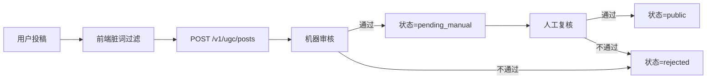

# 05 · 数据授权分级 + 合规策略 + 风险预案

> 本文件是这个项目的"法律风险红线手册"。在数据来源、视觉版权、UGC 合规、小程序审核、官方关系这 5 个维度上，给出分级与预案。

**原则**：**宁可慢一点上线，不可因为版权或合规出事。**

---

## 一、数据分级总览

我们把所有内容分为三类，不同类别用不同策略：

| 分类 | 含义 | 代表 | 风险等级 | MVP-A 态度 |
|---|---|---|---|---|
| **事实型** | 可公开查到的客观事实 | 精灵编号、属性、种族值、克制倍率 | 低 | 自整理 + 注明来源 |
| **表达型** | 具有独创性的文字/描述 | WIKI 长文、攻略、角色介绍段落 | 中-高 | 不直接搬用；自写一句话 |
| **视觉型** | 图片、图标、模型 | 立绘、地图、界面截图 | **高** | 自绘或空位；未授权绝不用 |

---

## 二、事实型数据：低风险但必须规范

### 2.1 原则

- 客观事实本身不受版权保护（属性、数值、关系等）
- 但**表格布局、数据结构、组织方式**的独创性可能受保护 → 不直接复制 WIKI 的表
- 必须**自己重新整理**，形成我们的数据结构

### 2.2 采集流程

```
1. 从多个来源交叉验证（WIKI、官方资料、社区讨论）
2. 录入到我们自己的数据模型（见 02-data-model-and-scope.md）
3. 至少 1 个来源注明 sources[]，含 url 与 fetchedAt
4. 人工二审后标记 trustLevel = 'verified'
```

### 2.3 展示规范

- 详情页角落常驻"数据来源"入口
- 长按字段（P2）可看字段级来源
- "关于页"有总的"数据采集说明"文档

### 2.4 禁止行为

- ❌ 直接截图 WIKI 作为图片展示
- ❌ 直接复制 WIKI 段落文字
- ❌ 伪造"权威来源"（如标注"官方数据"但并非官方）

---

## 三、表达型内容：中-高风险，MVP-A 不搬运

### 3.1 原则

- 他人写的 WIKI 描述、攻略文字、角色分析，都是**著作权**覆盖范围
- 我们 MVP-A **不搬运任何表达型内容**

### 3.2 MVP-A 的做法

- 精灵详情的"一句话介绍"：**全部自写**，≤ 60 字，避免直接复述
- 不放长背景故事
- 不放攻略段落
- 不放他人分析文字

### 3.3 二期起的做法（UGC 阶段）

- 用户投稿 → 我们平台授权（同时用户保留原著作权）
- 用户协议明确"投稿即授予我们非独家、可改编、可展示"的权利
- 明显的剽窃内容由审核拦截或下架

### 3.4 官方授权内容

- 如果未来能和游戏官方或 WIKI 站点达成合作，可引入其内容
- 合作前必须书面授权 → 存档
- 展示时标注"由 XX 授权提供"

---

## 四、视觉型资源：高风险，MVP-A 的重点处理

### 4.1 原则

- 精灵立绘、图标、地图、界面都是**原版权方的作品**
- 小程序审核对"未授权的游戏素材"敏感
- **宁可空位，不可未授权**

### 4.2 视觉资产分类与处理

| 资产 | 来源 | MVP-A 策略 | 长期策略 |
|---|---|---|---|
| 产品 Logo | 自设计 | 使用 | 注册商标 |
| TabBar 图标 | 自设计 / 开源图标库 | 使用 | 持续维护 |
| 属性图标（18 个） | **自绘** | 自绘 | 成为品牌资产 |
| 精灵立绘 | 原版权方 | **空位或简笔替代** | 等授权或自绘 |
| 地图 / 场景图 | 原版权方 | 不使用 | 延后 |
| 官方活动海报 | 原版权方 | 不使用 | 只引流不展示 |

### 4.3 精灵立绘的三套备选方案（按优先级）

#### 方案 A（最优）：自绘原创立绘

- 找一位插画合作（外包或内部）
- 预算按首批 200 只 × 单价评估
- 绘制时避免过度复刻原版（做成"我们的风格"）
- **版权归产品方所有**

#### 方案 B（次优）：授权使用玩家创作

- 发起"画师合作"计划，邀请社区画师为首批精灵创作
- 签订授权协议（非独家 / 署名 / 不可转授）
- 鼓励画师在发布时附带自己的简介与外链卡片（为二期博主生态埋种子）
- **未上线前不承诺稿费**，可以承诺曝光权益

#### 方案 C（兜底）：符号化/简笔替代

- 用属性色圆 + 首字母 + 简单几何做识别图
- 清晰标注"立绘制作中"
- 不影响核心功能，但用户体验降级明显

### 4.4 MVP-A 首发策略

建议按"方案 B 招募 + 方案 C 兜底"：

- Phase 0 开始同步启动"画师合作"招募
- Phase 2 第 2 周仍未集齐 → 启用方案 C 的符号化视觉
- 绝不使用原版权方素材，即使是"引用模糊示意"

### 4.5 官方品牌名与商标

- 我们产品**不使用**"洛克王国"字样作为产品主名
  - 当前代号：**洛克助手·Malt Games**（可备案字样）
  - 小程序昵称、公众号名称慎选，避免侵权
- **绝对不**用游戏官方 Logo
- **绝对不**宣称"官方 / 官方合作 / 官方推荐"

---

## 五、UGC 合规（二期起，但 API 设计从 D1 预埋）

### 5.1 三类风险 UGC

| 类型 | 例子 | 处理策略 |
|---|---|---|
| 敏感内容 | 涉黄、涉政、涉暴 | 自动拦截 + 人工二审 |
| 抄袭内容 | 复制他人攻略 | 举报 + 下架 |
| 引流与广告 | 私人二维码、导流 | 机器识别 + 规则限制 |

### 5.2 审核工具清单

- **微信内容安全 API**：`msgSecCheck` / `imgSecCheck`（小程序原生）
- **云端内容审核**：阿里云/腾讯云文本审核、图片鉴黄
- **关键词库**：自维护 + 第三方敏感词（政治/低俗/广告）
- **人工审核后台**（CMS）：见 `06-api-contract`

### 5.3 审核流程（二期上线时）



### 5.4 API 预埋（MVP-A 即定）

所有"可能涉及 UGC"的数据模型都加：

```typescript
interface UgcEntity {
  status: 'draft' | 'pending_auto' | 'pending_manual' | 'public' | 'hidden' | 'rejected';
  reviewNote?: string;
  reviewerId?: string;
  reviewedAt?: string;
  flagCount?: number;        // 被举报次数
  sensitiveScore?: number;   // 机器打分 0-100
}
```

### 5.5 用户分级与限制

| 等级 | 限制 | 获得条件 |
|---|---|---|
| 未认证 | 一天 1 条投稿 | 静默登录即可 |
| 已实名（后期可选） | 一天 10 条 | 实名认证 |
| 信誉用户 | 一天 30 条 + 免人工审核 | 90 天无违规 + 多篇通过 |
| 封禁 | 不可投稿 | 3 次违规累计 |

MVP-A 所有 UGC 入口都不开放 → 不涉及这一块，但 API 预留字段。

---

## 六、小程序审核预埋项

### 6.1 微信小程序上架必过清单

- [ ] 小程序类目正确（选"工具类 → 生活服务助手"或"游戏类 → 游戏助手"，具体需咨询）
- [ ] 隐私协议政策正确（收集哪些数据、用于什么、如何删除）
- [ ] 用户服务协议
- [ ] 关于页包含：开发者信息、ICP 备案号（若 H5 域名备案）、版权声明
- [ ] 所有外部图片通过合法域名（配置到小程序后台）
- [ ] `msgSecCheck` 对用户输入（搜索、反馈内容）做内容安全检查
- [ ] **不含**任何未授权游戏官方素材
- [ ] **不含**诱导分享（"分享后解锁"等）
- [ ] **不含**诱导关注（"关注公众号领取"等）
- [ ] **不含**虚拟支付绕过（若未来涉及付费）
- [ ] **不含**隐式广告（误导性跳转）

### 6.2 小程序订阅消息（P8 起使用）

- 涉及精灵上新提醒、数据更新提醒、社区互动提醒时使用
- 一次订阅一次通知，不长期订阅
- 模板申请必须符合"真实业务"原则

### 6.3 数据上报与加密

- 所有用户行为数据上报需有隐私政策覆盖
- 传输必须 HTTPS
- 敏感字段（即使 MVP-A 不采集）规划时使用加密

---

## 七、H5 合规

### 7.1 域名与备案

- 主域名：`loka-helper.com`（示例，待确认）
- 必须完成 ICP 备案（国内访问需要）
- 备案主体：个人 或 公司（后者更稳）

### 7.2 Cookie 与隐私

- H5 首次访问弹"隐私告知条"（中国大陆版可轻量化，海外需严格）
- localStorage 里的 deviceId 在"隐私政策"中说明

### 7.3 公安备案（按法规）

- 若有 UGC → 需要"公安备案"
- MVP-A 无 UGC，可暂缓
- 二期开放内容前必须完成

---

## 八、版权与来源展示

### 8.1 全局位置

- 小程序 / H5 的 **关于页** 固定展示：
  - 产品名：洛克助手·Malt Games
  - 版本：前端 v1.0.0 / 数据 v2026.04.3
  - 开发团队：xxx（可署团队名）
  - 数据来源声明：本产品数据来自自整理及公开社区资料，向原整理者致敬
  - 免责声明：本产品为非官方玩家助手工具，《洛克王国：世界》及相关素材版权归原方所有

### 8.2 免责声明示例文案

> 洛克助手·Malt Games是由玩家团队制作的非官方辅助工具，旨在为玩家提供更便捷的资料查询与计算体验。本产品与游戏官方无任何隶属或合作关系。涉及游戏名称、角色、画面等权益归游戏原厂方所有。本产品数据由团队自行整理与校对，如有错误欢迎通过反馈入口指正。

### 8.3 致谢页（推荐）

- 感谢 WIKI 贡献者
- 感谢内测玩家
- 感谢合作画师

---

## 九、官方风险预案

### 9.1 可能的负面信号

| 信号 | 严重度 | 响应 |
|---|---|---|
| 官方公众号/官网没提及我们 | 低 | 继续运营，保持低调 |
| 官方公开说"请勿使用第三方工具" | 中 | 复盘产品话术，确保不碰红线 |
| 官方私信或邮件联系 | 高 | 24 小时内回复，友好沟通 |
| 官方发律师函 | 极高 | 立即下架相关功能，配合 |
| 小程序被投诉下架 | 极高 | 申诉 + 评估继续可行性 |

### 9.2 预案 · 软着陆路径

1. 立刻下架涉及的视觉/内容
2. 发布产品说明："我们是玩家工具，尊重官方权益"
3. 主动沟通（发邮件到官方邮箱）
4. 视结果：
   - 能合作 → 争取授权
   - 能共存 → 调整为严格合规版本
   - 不能共存 → 参考 `01-mvp-a` 的退守路径或直接关停

### 9.3 沟通话术模板（预备）

> 您好，我们是一支玩家团队制作的洛克王国辅助工具《洛克助手·Malt Games》。我们非常尊重官方权益，已严格避免使用官方视觉素材与独家数据。若此工具存在任何让贵方不舒服的地方，欢迎告知，我们会立即配合调整。期望能与官方沟通合作，共建玩家生态。

---

## 十、不做 & 红线清单

以下事项**任何阶段不做**：

- ❌ 不做账号代练、代打、代刷
- ❌ 不做游戏自动化脚本
- ❌ 不做精灵买卖货币化
- ❌ 不做可提现的虚拟币
- ❌ 不伪装官方
- ❌ 不搬运未授权视觉资源
- ❌ 不诱导分享 / 诱导关注
- ❌ 不做强制登录
- ❌ 不收集敏感信息（身份证、银行卡）
- ❌ 不在未授权情况下抓取大量官方服务器数据

---

## 十一、合规 Owner 与节奏

- **合规 Owner**：产品负责人（你）
- **技术执行**：后端负责人（敏感词/审核/接口）、前端负责人（隐私弹窗/反馈入口）
- **Phase 0 完成前必须**：
  - 隐私政策 & 用户协议草案
  - 合规自查清单初稿
- **Phase 4（MVP-A 内测前）必须**：
  - 小程序审核清单过一遍
  - 用户协议与隐私政策上线
- **每 Phase 结束复盘**：合规风险再过一遍

---

## 十二、评审 checklist

- [ ] 三类数据分级团队是否认同
- [ ] 视觉资产方案 A/B/C 的预算与时间是否明确
- [ ] 小程序审核清单是否已经由申请人认领
- [ ] 用户协议 / 隐私政策草案是否有人认领
- [ ] 官方风险话术模板是否已保存到团队知识库
- [ ] "不做 & 红线清单" 是否全员周知

---

## 附：本文件版本

- v1.0 · 2026-04-21 · Phase 0 初稿
